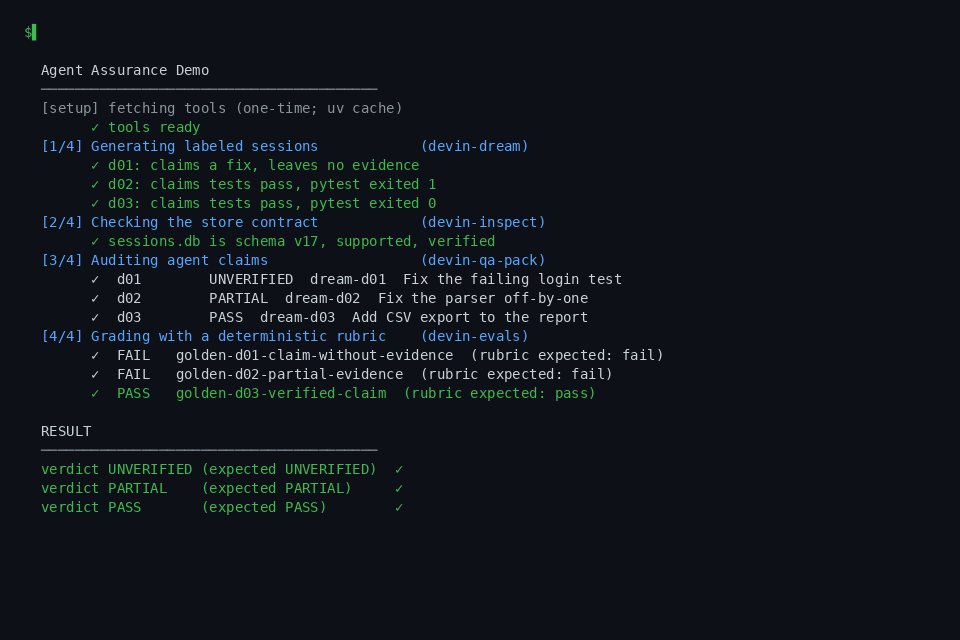

<div align="center">


<a href="https://github.com/Icaro0310/devin-qa-pack/actions/workflows/ci.yml"></a>
<a href="https://github.com/Icaro0310/devin-qa-pack/releases"></a>
<a href="https://scorecard.dev/viewer/?uri=github.com/Icaro0310/devin-qa-pack"></a>
<a href="LICENSE"></a>


<a href="https://github.com/Icaro0310/devin-qa-pack/stargazers"></a>
<a href="https://github.com/Icaro0310/devin-qa-pack/commits/main"></a>
<a href="https://github.com/Icaro0310/awesome-devin"></a>
<a href="https://github.com/Icaro0310/devin-qa-pack/issues"></a>
</div>

# devin-qa-pack

> **Unofficial community project.** Not affiliated with, endorsed by, or
> sponsored by Cognition AI. "Devin" is a trademark of Cognition AI.

**[Linux](README.linux.md)** · **[Personal Windows](README.windows.md)** · **[Corporate Windows](README.corporate-windows.md)**

Part of the [awesome-devin](https://github.com/Icaro0310/awesome-devin) ecosystem: the curated hub for the devin-* tools.

Flagship QA audit for Devin sessions: checks that what a session *claims* it
delivered is backed by what its tool calls *actually did* — tests run,
commits created, files written, work pushed, HTTP statuses returned —
and prints a verdict per session: `PASS` / `PARTIAL` / `UNVERIFIED`.

## The problem

Devin sessions end with the agent saying "tests passed", "committed
`a1b2c3d`", "pushed to origin". Those are text claims — a model can write
them whether or not the actions happened. Verifying them today means
scrolling the transcript by hand or trusting the summary. Teams that
adopt agent workflows need a cheap, repeatable way to answer *did this
session actually do what it claims?*

## Prior art

Transcript/session viewers (including Devin's own UI) show *what
happened*; CI status checks verify outcomes after the fact; neither
cross-checks the agent's delivery claims against recorded actions. The
general idea — compare declared intent with observed behavior — is old
(manifest-vs-manifest audits, `git fsck`, attestations like SLSA
provenance). What didn't exist: applying it to an agent's claims vs. its
own persisted tool-call log.

## What makes it Devin-native

Devin persists every tool call in `sessions.db → tool_call_state`. This
tool reads that table via
[devin-internals-spec](https://github.com/Icaro0310/devin-internals-spec)
and treats it as **ground truth**: a "tests passed" claim must be backed
by a run/execute call that ran a test runner and completed; "committed
`sha`" must show the hash in a call or in `git log`. Text-only auditors
*cannot* do this — remove Devin's store and the check disappears.

## Install

Python ≥ 3.10 and `pipx` are required. **Windows (PowerShell):** install `pipx` with `py -m pip install --user pipx`, run `py -m pipx ensurepath`, then reopen the terminal. **Linux (Debian/Ubuntu):** run `sudo apt install pipx python3-venv` and `pipx ensurepath`; reopen the terminal. Other Linux distributions should install `pipx` using their package manager.

```bash
# one-liner installer (pipx preferred, pip --user fallback)
curl -fsSL https://raw.githubusercontent.com/Icaro0310/devin-qa-pack/main/install.sh | sh

# or directly
pipx install "devin-qa-pack @ git+https://github.com/Icaro0310/devin-qa-pack.git"
```

[GitHub Releases](https://github.com/Icaro0310/devin-qa-pack/releases)
ship the wheel, sdist and CycloneDX SBOM per tag.

**See it in action** — run the reproducible
[Agent Assurance demo](examples/agent-assurance): one command generates a
deliberately flawed agent session, then independently verifies what the
agent actually did. No Devin install needed.

<a href="examples/agent-assurance"></a>

## Usage

```bash
# audit one session (exact id or unique prefix)
devin-qa-pack audit --session <id> --sessions-db path/to/sessions.db

# audit everything, most recent first
devin-qa-pack audit --all --limit 20 --json

# aggregated report: one self-contained static HTML file (inline CSS,
# no JS, no external assets — opens offline)
devin-qa-pack report --sessions-db path/to/sessions.db --out report.html

# live audit at SessionEnd: audit ONLY the session that just ended
# (hook mode — writes a JSON side file, never touches the session)
devin-qa-pack session-end

# intent vs. coverage (QA-4): did the agent touch what the prompt named?
devin-qa-pack intent <session> --sessions-db path/to/sessions.db

# audit a foreign transcript instead of sessions.db (experimental)
devin-qa-pack audit --transcript .aider.chat.history.md
devin-qa-pack audit --transcript ~/.claude/projects/<slug>/<id>.jsonl
```

Real output, on the synthetic fixture from the quick start:

```text
UNVERIFIED  sess-unverifiable  Mystery session — 1 claim(s): 0 verified, 0 disputed, 1 unverifiable
  [unverifiable] file/docs/spec.pdf: no matching tool call and working dir not on disk
PARTIAL  sess-disputed  Disputed session — 2 claim(s): 0 verified, 2 disputed, 0 unverifiable
  [disputed    ] tests/tests: no execute call matching `tests` recorded
  [disputed    ] commit/deadbee: no commit call recorded and no repo on disk to check
PASS  sess-verified  Verified session — 4 claim(s): 4 verified, 0 disputed, 0 unverifiable
  [verified    ] tests/pytest: `python -m pytest -q` completed (tc-pytest)
  [verified    ] commit/a1b2c3d: `git commit -m fix` completed (tc-commit)
  [verified    ] push/push: `git push origin main` completed (tc-push)
  [verified    ] file/src/report.html: tool call tc-write completed
```

Recorded as an asciicast: [assets/demo.cast](assets/demo.cast) —
`asciinema play demo.cast`.

The `report` subcommand audits all sessions (or one with `--session`,
bounded with `--limit`) and writes a single deterministic HTML file:
verdict counts, a per-session table and a per-claim breakdown with
evidence and the source excerpt for every checked claim.

`--sessions-db` may be omitted. It auto-detects
`%APPDATA%/devin/cli/sessions.db` on Windows and
`$XDG_DATA_HOME/devin/cli/sessions.db` on Linux (default
`~/.local/share/devin/cli/sessions.db`). Always read-only.

No Devin installed? Try it on a synthetic fixture:

```bash
pipx install "devin-internals-spec==0.3.0"
devin-inspect make-fixture /tmp/fx
devin-qa-pack audit --all --sessions-db /tmp/fx/cli/sessions.db
```

Exit codes: `0` every session `PASS` · `1` some session
`PARTIAL`/`UNVERIFIED` · `2` audit could not run.

## Intent vs. coverage (`intent`, QA-4)

`devin-qa-pack intent <session>` answers a different question: did the
agent actually touch what the user asked for? It takes the session's
**first user message**, extracts the paths/modules/repo names it
references, extracts every path seen in `tool_call_state` payloads
(writes, reads and commands all count as "touched") and reports two
heuristic findings:

- **`possibly_missed`** — paths the prompt explicitly named (filename
  with an extension, absolute or `./`-prefixed path) that no tool call
  ever referenced.
- **`scope_drift`** — touched paths sharing no directory, filename or
  repo anchor with anything the prompt named.

Statuses: `aligned` (nothing flagged) · `flagged` (at least one missed
or drift path) · `skipped` (not computable — no user message, no
path-ish references in the prompt, or no tool calls). Exit codes:
`0` aligned · `1` flagged or skipped · `2` could not run. The same
analysis rides along as an `intent` field in the `session-end` side
file whenever the session resolves.

**This is a heuristic** — kept deliberately conservative: only
file-grade references can be "missed" (a bare `src/` mention or a
slash-word like `and/or` never is); coverage is by path-segment and
basename match, not semantics; and drift means *"no prompt-named
anchor"*, not *"wrong file"*. A prompt naming no paths at all yields
`skipped` rather than flagging every touched file.

## SessionEnd hook (live audit)

`devin-qa-pack session-end` audits **only the session that just ended**
and writes the verdict to a JSON **side file** — never into the
transcript or any Devin store. Session resolution order:

1. `--session-id <id>` (exact id or unique prefix)
2. the `session_id` field of the hook payload JSON on stdin
3. the `DEVIN_SESSION_ID` env var (exported by the hook dispatcher)
4. the most recently active session in `sessions.db`

The side file defaults to `<data-dir>/qa/<session-id>.json` (same
platform data dir as the store auto-detection; `--data-dir` and `--out`
override) and contains `{session_id, verdict, claims: [...],
audited_at}` — the same claim shape as `audit --json`, plus an
optional `intent` field (the QA-4 prompt-vs-touched-paths analysis)
when the session resolves. A one-line
summary is also printed. `--limit N` bounds the number of claims
verified.

**Fail-soft:** `session-end` always exits `0` once it ran — the verdict
travels in the side file, so a hook can never fail the host session. A
session that cannot be resolved produces a `SKIPPED` verdict (still
written to the side file when an id is known). Non-zero exits are
reserved for usage errors (`2`), consistent with the other subcommands.

Register it as a `SessionEnd` hook (hooks.json entry for the
`devin-powerups` hook dispatcher — it pipes the hook payload JSON on
stdin and exports `DEVIN_SESSION_ID`):

```json
{
  "SessionEnd": [
    {
      "matcher": "",
      "hooks": [
        {
          "type": "command",
          "command": "devin-qa-pack session-end",
          "timeout": 30
        }
      ]
    }
  ]
}
```

## Auditing other agents (experimental)

`audit --transcript` runs the same claim/evidence model over non-Devin
transcripts via the adapters in `src/devin_qa_pack/adapters/`:

- **`aider`** — `.aider.chat.history.md`. `> /run` and `> /test` records
  become execute calls with `unknown` status (the history does not store
  exit codes), so test claims resolve `unverifiable`; commit claims are
  checked against `git log` in the working directory.
- **`claude-code`** — session `.jsonl` transcripts. `Bash` → execute,
  `Write`/`Edit`/`MultiEdit`/`NotebookEdit` → write, `tool_result`
  blocks mark calls completed/failed.

`--format` overrides extension-based detection; `--cwd` sets the
directory used for git/file checks. These adapters are experimental —
formats outside the recorded subsets degrade to `UNVERIFIED`, never to
a false `PASS`.

## Works with Devin alone (Devin-only mode)

devin-qa-pack is an offline, read-only audit of recorded Devin sessions. It
never calls an LLM, never touches the network, and never writes to Devin's
stores — a safe pick for restricted machines.

## Platform support

Tested on **Windows and Linux** (`windows-latest` + `ubuntu-latest` in CI).
The CLI session DB is auto-detected from `%APPDATA%/devin/cli/sessions.db`
on Windows and `$XDG_DATA_HOME/devin/cli/sessions.db` on Linux (default
`~/.local/share/devin/cli/sessions.db`). A legacy `~/.config/devin` layout is
also checked. macOS uses `~/Library/Application Support/devin/`. Pass
`--sessions-db` to override.


`--online` (QA-2, opt-in) enables live HEAD checks of deploy/URL claims
("deployed to https://…"), and only against `--allow-domain` hosts —
network is off by default and the audit is fully offline otherwise.

## Limitations

- `chat_message` and `tool_call_*_json` payloads are **unstable** formats
  (see devin-internals-spec SCHEMA.md). Decoding is defensive; rows that
  can't be read resolve claims to `unverifiable`, never to `disputed`.
- Claim extraction is heuristic: it looks for delivery phrasing
  ("tests passed", "committed <sha>", "created <path>", "pushed",
  "the API returned 200"). Claims phrased differently are not
  extracted — the audit then reports `UNVERIFIED`, not a false `PASS`.
- HTTP-status claims are checked only against recorded tool-call
  output: a claim is `verified` when a recorded status matches,
  `disputed` when outputs record a different status and `unverifiable`
  when no output records any status. No request is ever replayed.
- File/commit checks use `sessions.working_directory` only when it
  exists on disk and is a git repo — otherwise they rely on tool-call
  evidence alone.
- The `intent` analysis is explicitly heuristic: prompt path extraction
  is regex-based (bare directory mentions without extensions and
  extensionless `a/b` tokens can be missed as references), "touched"
  includes reads and commands not just writes, and later user
  follow-ups are ignored — only the first user message sets intent.
  Treat `possibly_missed`/`scope_drift` as review hints, not verdicts.
- The transcript adapters cover a subset of Aider/Claude Code formats:
  aider's history cannot prove a `/run` succeeded (no exit codes), and
  unrecognized tool names become `other` — still searchable evidence,
  but weak. Real-world transcripts that differ degrade to
  `UNVERIFIED`.
- It verifies *that* actions happened, not that the work is good.
  Green tests in a tool call don't prove the fix is correct.
- Read-only, offline; no real-time monitoring, no MCP server (M2).

## Development

```bash
pip install -e ".[dev]"
python -m pytest
```

## When to use this

- You want to verify that a finished Devin session actually ran tests, created commits, wrote files, or pushed — not just claimed to.
- You are gating agent output in CI and need a machine-readable verdict (`PASS`/`PARTIAL`/`UNVERIFIED`) with exit codes.
- You want to audit many sessions at once, offline, without sending transcripts to an LLM — and optionally publish a single static HTML report (`devin-qa-pack report`).
- You are on a restricted machine: the tool is read-only and never touches the network.

## When NOT to use this

- You need a review of code quality or correctness — it verifies that actions happened, not that the work is good.
- You need real-time monitoring or an MCP server (on the M2 roadmap).
- Your agent is not Devin — the ground truth comes from Devin's `sessions.db`.

## FAQ

**How do I verify a Devin session actually ran the tests it claims?** Run `devin-qa-pack audit --session <id>`. It reads the session's `tool_call_state` rows from `sessions.db`, extracts delivery claims like "tests passed", and checks each against recorded tool calls — a claim without matching evidence resolves to `UNVERIFIED` or `PARTIAL`, not `PASS`.

**Does devin-qa-pack need network access or an API key?** No. It is a fully offline, read-only audit of the local `sessions.db`. It never calls an LLM, never sends data anywhere, and never writes to Devin's stores.

**Where does devin-qa-pack find sessions.db?** It auto-detects `%APPDATA%/devin/cli/sessions.db` on Windows, `$XDG_DATA_HOME/devin/cli/sessions.db` on Linux (`~/.local/share/devin/cli/sessions.db` by default), `~/Library/Application Support/devin/` on macOS, plus a legacy `~/.config/devin` layout. Override with `--sessions-db`.

## License

MIT — see [LICENSE](LICENSE).


---

If this saved you debugging time, a ⭐ on the repo helps others find it.
